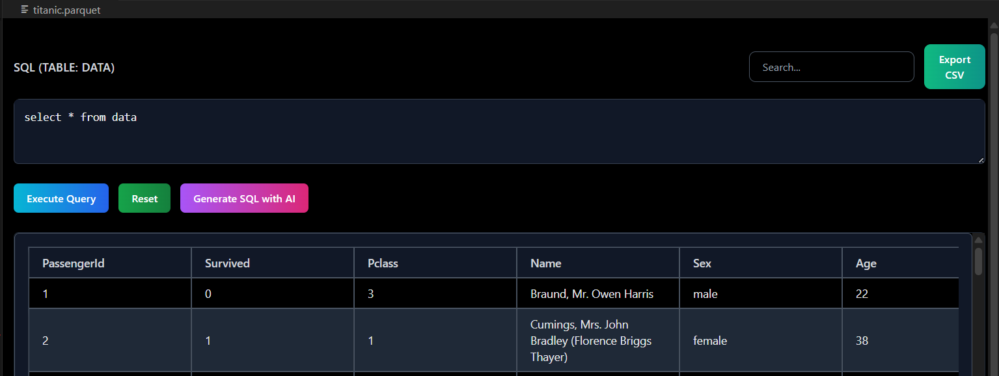
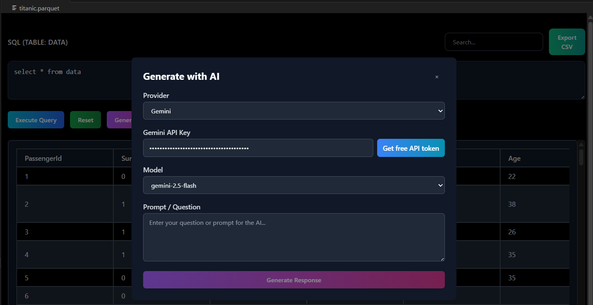

# 📊 Flat File Reader - VS Code Extension

> Seamlessly explore and analyze **CSV, TSV, Parquet, and Excel files** with a powerful, intuitive table viewer – directly in VS Code. Now with **AI-powered SQL generation**! No external dependencies required!



### 🤖 AI-Powered SQL Generation



---

## ✨ Features

- 🚀 **Lightning Fast** – Powered by DuckDB for blazing-fast data processing
- 🤖 **AI-Powered SQL Generation** – Generate complex queries using OpenAI GPT or Google Gemini
- 📁 **Multi-Format Support** – CSV, TSV, Parquet, Excel files
- 🔍 **Advanced Querying** – Run custom SQL queries on your data
- 🎯 **Smart Search** – Full-text search across all columns
- 📄 **Pagination** – Navigate through large datasets efficiently (1000 rows per page)
- 📤 **Export** – Save filtered results as CSV
- 🎨 **Modern UI** – Beautiful dark theme with smooth animations
- 🔄 **Reset** – Quickly reset to view all data
- 🛡️ **No Dependencies** – Pure Node.js, works out-of-the-box

---

## 📦 Installation

1. Open **VS Code**
2. Press `Ctrl+Shift+X` (Windows) to open Extensions
3. Search for **"Flat File Reader"**
4. Click **Install**

That's it! 🎉 No additional setup or dependencies required.

---

## 🚀 Usage

### Opening Files
- **Right-click** any supported file → **Open With... → Flat File Reader**
- Or use Command Palette: `Ctrl+Shift+P` → **"Flat File Reader: Open File"**

### Interface Overview
- **SQL Editor** – Write custom queries (table name: `data`)
- **Search Bar** – Quick text search across all columns
- **Execute Query** – Run your SQL with loading indicator
- **Reset** – Return to `SELECT * FROM data` and reload all data
- **Export CSV** – Download current results as CSV

### Example Queries
```sql
-- View first 100 rows
SELECT * FROM data LIMIT 100

-- Filter by condition
SELECT * FROM data WHERE age > 25

-- Aggregate data
SELECT category, COUNT(*) as count FROM data GROUP BY category
```

### 🤖 AI-Powered SQL Generation

**Generate SQL queries using AI!** Click the **"Generate SQL with AI"** button to open the AI assistant.

#### Setup Your API Key
1. **Choose Provider**: Select OpenAI or Gemini (free option available)
2. **Get API Key**:
   - **Gemini (Free)**: Click "Get free API token" for step-by-step instructions
   - **OpenAI**: Visit [OpenAI API Keys](https://platform.openai.com/api-keys)
3. **Enter Key**: Paste your API key in the secure input field
4. **Select Model**: Choose your preferred AI model

#### Generate Queries
- **Describe what you want**: "Show me sales by region" or "Find customers over 30"
- **AI generates SQL**: Get complex queries instantly
- **Insert & Execute**: Click "Insert" to add the query to your editor
- **Iterate**: Ask follow-up questions to refine your analysis

**Example AI Prompts:**
- "Calculate total revenue by product category"
- "Find the top 10 customers by purchase amount"
- "Show monthly trends for the last year"
- "Identify outliers in the price column"

---

## 📋 Supported File Formats

| Format | Extensions | Notes |
|--------|------------|-------|
| CSV | `.csv` | Comma-separated values |
| TSV | `.tsv` | Tab-separated values |
| Parquet | `.parquet`, `.pq` | Columnar storage format |
| Excel | `.xlsx`, `.xls` | Spreadsheet files |

---

## 📄 License

This project is licensed under the MIT License - see the [LICENSE](LICENSE) file for details.

---

## 🙏 Acknowledgments

- [DuckDB](https://duckdb.org/) – Fast analytical database
- [ExcelJS](https://github.com/exceljs/exceljs) – Excel file processing
- [PapaParse](https://www.papaparse.com/) – CSV parsing
- [VS Code Extension API](https://code.visualstudio.com/api) – Extension framework

---

**Made with ❤️ for data enthusiasts everywhere!**

If you find this extension useful, please ⭐ star the repository and share with your colleagues!
