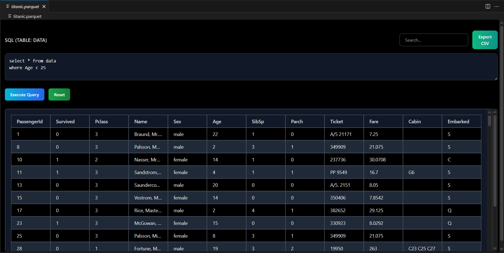

# 📊 Flat File Reader - VS Code Extension

> Seamlessly explore and analyze **CSV, TSV, Parquet, and Excel files** with a powerful, intuitive table viewer – directly in VS Code. No external dependencies required!



---

## ✨ Features

- 🚀 **Lightning Fast** – Powered by DuckDB for blazing-fast data processing
- 📁 **Multi-Format Support** – CSV, TSV, Parquet, Excel files
- 🔍 **Advanced Querying** – Run custom SQL queries on your data
- 🎯 **Smart Search** – Full-text search across all columns
- 📄 **Pagination** – Navigate through large datasets efficiently (1000 rows per page)
- 📤 **Export** – Save filtered results as CSV
- 🎨 **Modern UI** – Beautiful dark theme with smooth animations
- 🔄 **Reset** – Quickly reset to view all data
- 🛡️ **No Dependencies** – Pure Node.js, works out-of-the-box

---

## 📦 Installation

1. Open **VS Code**
2. Press `Ctrl+Shift+X` (Windows) to open Extensions
3. Search for **"Flat File Reader"**
4. Click **Install**

That's it! 🎉 No additional setup or dependencies required.

---

## 🚀 Usage

### Opening Files
- **Right-click** any supported file → **Open With... → Flat File Reader**
- Or use Command Palette: `Ctrl+Shift+P` → **"Flat File Reader: Open File"**

### Interface Overview
- **SQL Editor** – Write custom queries (table name: `data`)
- **Search Bar** – Quick text search across all columns
- **Execute Query** – Run your SQL with loading indicator
- **Reset** – Return to `SELECT * FROM data` and reload all data
- **Export CSV** – Download current results as CSV

### Example Queries
```sql
-- View first 100 rows
SELECT * FROM data LIMIT 100

-- Filter by condition
SELECT * FROM data WHERE age > 25

-- Aggregate data
SELECT category, COUNT(*) as count FROM data GROUP BY category
```

---

## 📋 Supported File Formats

| Format | Extensions | Notes |
|--------|------------|-------|
| CSV | `.csv` | Comma-separated values |
| TSV | `.tsv` | Tab-separated values |
| Parquet | `.parquet`, `.pq` | Columnar storage format |
| Excel | `.xlsx`, `.xls` | Spreadsheet files |

---

## 🛠️ Development

### Prerequisites
- [Node.js](https://nodejs.org/) 18+ (LTS recommended)
- [VS Code](https://code.visualstudio.com/) with Extension Development Host

### Setup
```bash
# Clone the repository
git clone https://github.com/MaheshGachale/Flat-File-Reader.git
cd flat-file-reader

# Install dependencies
npm install

# Build the extension
npm run build

# Test in Extension Development Host
npm run dev
```

### Project Structure
```
├── src/
│   ├── extension.ts      # Main extension entry point
│   ├── fileLoader.ts     # Data loading logic (DuckDB + ExcelJS)
│   └── types.d.ts        # TypeScript type definitions
├── webview/
│   └── src/
│       ├── index.tsx     # React UI components
│       └── components/   # Table and other components
├── package.json
└── README.md
```

### Technologies Used
- **Backend**: Node.js, DuckDB, ExcelJS, PapaParse
- **Frontend**: React, TypeScript, Tailwind CSS, Framer Motion
- **Build**: Webpack, TypeScript Compiler

---

## 🤝 Contributing

We welcome contributions! Please:

1. Fork the repository
2. Create a feature branch: `git checkout -b feature/amazing-feature`
3. Commit your changes: `git commit -m 'Add amazing feature'`
4. Push to the branch: `git push origin feature/amazing-feature`
5. Open a Pull Request

### Development Guidelines
- Follow TypeScript best practices
- Add tests for new features
- Update documentation
- Ensure cross-platform compatibility

---

## 📄 License

This project is licensed under the MIT License - see the [LICENSE](LICENSE) file for details.

---

## 🙏 Acknowledgments

- [DuckDB](https://duckdb.org/) – Fast analytical database
- [ExcelJS](https://github.com/exceljs/exceljs) – Excel file processing
- [PapaParse](https://www.papaparse.com/) – CSV parsing
- [VS Code Extension API](https://code.visualstudio.com/api) – Extension framework

---

**Made with ❤️ for data enthusiasts everywhere!**

If you find this extension useful, please ⭐ star the repository and share with your colleagues!
